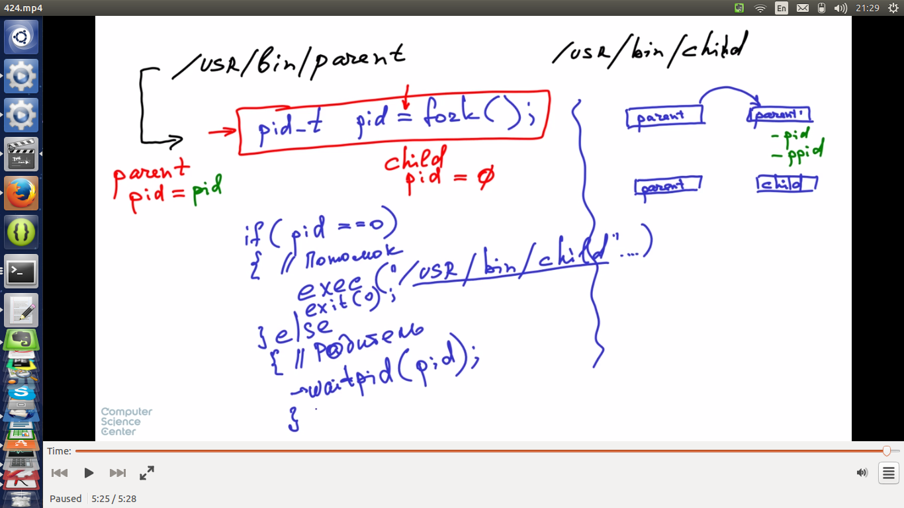


# Процесс
* процесс - контейнер, владелец ресурсов (память, открытые файлы и дескрипторы, сертификаты и credentials) и потоков исполнения
* pid - process id, ppid - parent pid
* init (pid=1) - родитель всех остальных процессов
* pstree, pstree -p - показывает pid
* echo $$ - pid текущего процесса
* связанная с процессом структура внутри ядра не удаляется до тех пор, пока родитель процесса не запросит код возврата
* при уничтожении процесса у которого есть потомки, родителем потомков становится init и он будет запрашивать код возврата
* процесс, который уже завершен, но не удален из таблицы процессов, называется зомби

# Создание процессов. 

* fork - точная копия текущего процесс (за искл нескольких деталей). Отличающиеся аттрибуты pid, ppid, не наследует блокировки памяти, не наследует список сигналов, ожидающих обработки, не наследует таймеры. man 2 fork для подробностей
* возвращаемое значение из fork в вызывающем (родительском) процессе =pid дочернего процесса и в дочернем процессе возвращаемое значение 0
* exec - замещение образа процесса. семейство функций. системный вызов execve (man 2 execve)
* wait - позволяет получить код возврата, что важно, чтобы не плодить зомби процессы

# Системный вызов Clone

* позволяет создавать копию текущего процесса.
* можно указать, что нужно скопировать, что создать заново, а что использовать совместно
* если разрешить использовать совместно память, можно получить аналог потоков
* процессу можно показать только часть файловой системы
* у процесса может быть свой "взгляд" на сетевое окружение
* man 2 clone
* примеры
  * можно склонировать процесс оставив общими открытые файлы. И родитель и потомок будут иметь доступ к этим файлам
  * можно сделать общим сетевое окружение
  * можно сделать общей память (а ля поток)
* передаем в clone функцию, которая будет вызвана в потомке и область памяти для стека потомка, некий набот флагов
* флаги
  * CLONE_FS - общая инфа о файловой системе
  * CLONE_PARENT - родителем указывается родитель родителя (можно использовать при создании потоков с одним родителем, нужно еще общую память указать)
* при удалении родителя удаляются и его потомки

## Контекcт процесса

* Открытые файлы
* Файловые системы
* Операции ввода / вывода
* Сетевое окружение
* Множество идентификаторов процесса
* Память
* Состояние регистров
* Имя хоста (hostname)

### 43_example
  * посмотреть pid bash - echo $$
  * запустить прогу
  * pstree [pid bash] - из второго терминала посмотреть на ее дерево

# Демоны
* демоны - процессы работающие в бекграунде
* Порядок создания демона
  * содается новый процесс через fork (будущий демон)
  * в демоне переход в корневой каталог /, чтобы при различных действиях с файловой системой (отмонтирование и тд), мы не заблокировали это действие тем, что находимся в текущем каталоге
  * установить в демоне новый id сессии. setsid(2)==man 2 setsid (set session id)
  * закрыть файлы стандартного i/o. close (stdin), close(stdout), close(stderr)
  
