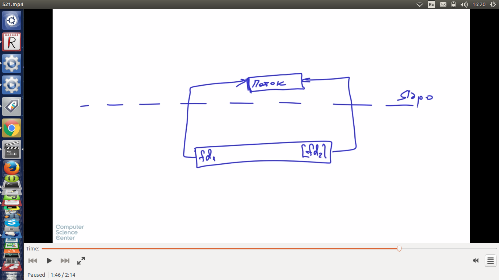
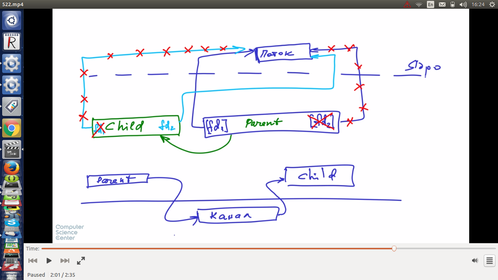
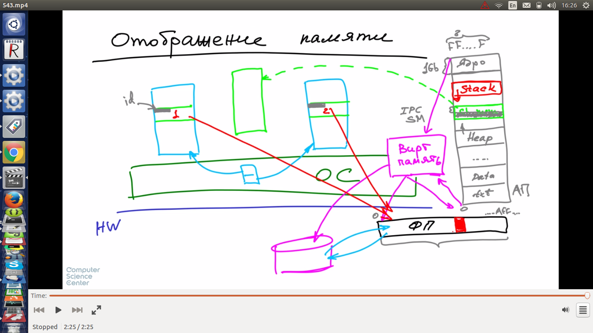
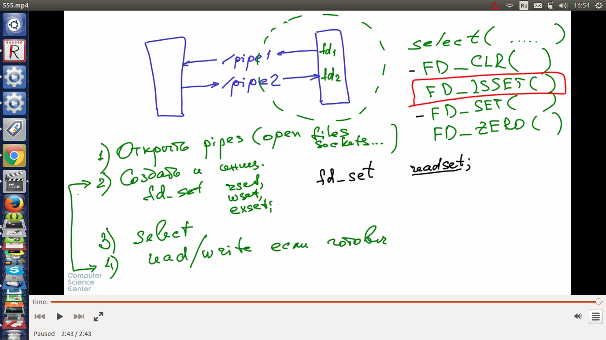

## Виды IPC в Линукс

* файлы
* сигналы. у сигнала в приложении может быть свой обработчик. сигнал отправляется через системный вызов
* каналы (pipes). 
  * Именованные - имеют имя в файловом пространстве имен
  * Неименованные (ps aux | grep ...)
* очереди сообщений (man mqopen mqsend ...)
* shared memory (специальный регион адресов, отображаемый на адресное пространство одного и другого приложения)
* сокеты (абстракция сетевых протоколов)
* POSIX семафоры
* RPC (man rpc)
* IPC (System V)
  
## Каналы

* сам канал в ядре

* если читать / писать в обе стороны, то нужно 2 канала
* man 2 pipe. пример канала потомок / родитель
* использование неименованных каналов из приложений
  * man 3 popen
* именованный канал - буфер в ядре, FIFO
  * можно создать утилитой командной строки. 
* можно из приложения
  * man 3 mkfifo
  
## Сигналы

* приложения имеют обработчики сигналов (в тч по умолчанию)
* сигнал 9, SIGSTOP - нельзя переопределить обработчик
* signal.h
* SIGINT=2. interrupt. Ctrl C
* SIGABRT=6. (abort(3))
* SIGTERM=15. просьба на завершение
* SIGKILL=9. безусловное завершение
* SIGCHILD=17. завершение потомка
* сигналы - один из основных интерфейсов для управления демонами
* kill - отправить сигнал процессу. по умолчанию вежливое завершение процесса
* kill -l - список имеющихся сигналов

### Программная часть интерфейса

* man 2 kill
* man 2 signal - установка обработчика сигналов
* пример 53_example. Перехват Ctrl C

## Разделяемая память

* в адресном пространстве процесса есть сегмент shared memory
  * нужен для отображения динамических библиотек
  * нужен для IPC
* механизм вирт. памяти отображает адресное пространство процесса частично на физ. память, частично на диск
* shared memory сегмент обоих процессов можно отобразить на одну физическую память

### Функции работы с shared memory

* shmget (man 2). позволяет получать или создавать регион памяти
  * size (параметр функции) округляется в верхнюю сторону до размера страницы памяти, т.к. организация памяти постраничная
* shmat. позволяет подключасться к существующему региону памяти
* shmdt. отключение от региона памяти
* shmctl. управление параметрами регионов shared memory

* ipcs - инфо утилита по shared memory

## Мультиплексирование ввода вывода

* позволяет приложениям наблюдать за несколькими файловыми дескипторами не блокируясь на них
* каналы блокируются на чтении, если нет данных
* по факту open может открывать файлы в NON-BLOCKING режиме для каких-то файлов

* man select
  * nfds - максимальное кол-во файл. дескрипторов за которыми надо наблюдать +1. Надо включить 3 по умолчанию выделяемые процессу (stin,out,err)
  * fdset - набор файловых дескрипторов, тестируемых на готовность (чтение, запись, исключит ситуации)
  * в примере в книге дескрипторы открываются как non-blocking. Т.е. select это просто утилита, которая регулярно опрашивает эти дескрипторы и не блокируется на них, т.к. они открыты не блокируемыми? Проверил на блокирующих дескрипторах, тоже работает
  * timeout - насколько процесс должен блокироваться на ожидание каждого дескриптора
  * по факту select блокируется до момента, когда в каком-то из дескрипторов, за которым он следит не появляются данные
  

