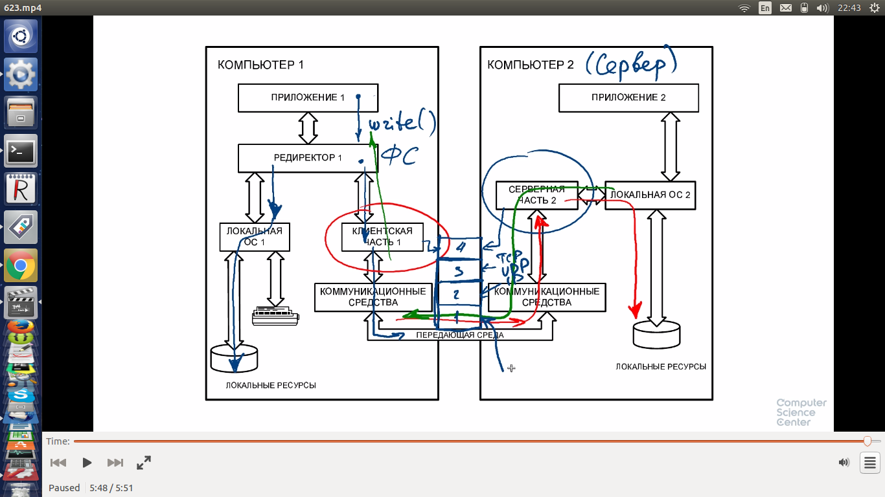
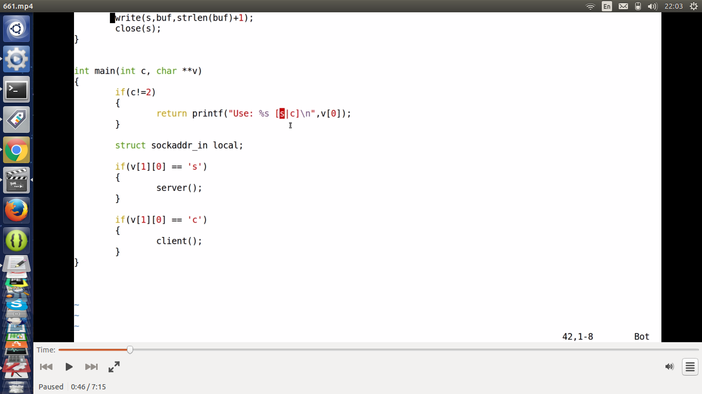
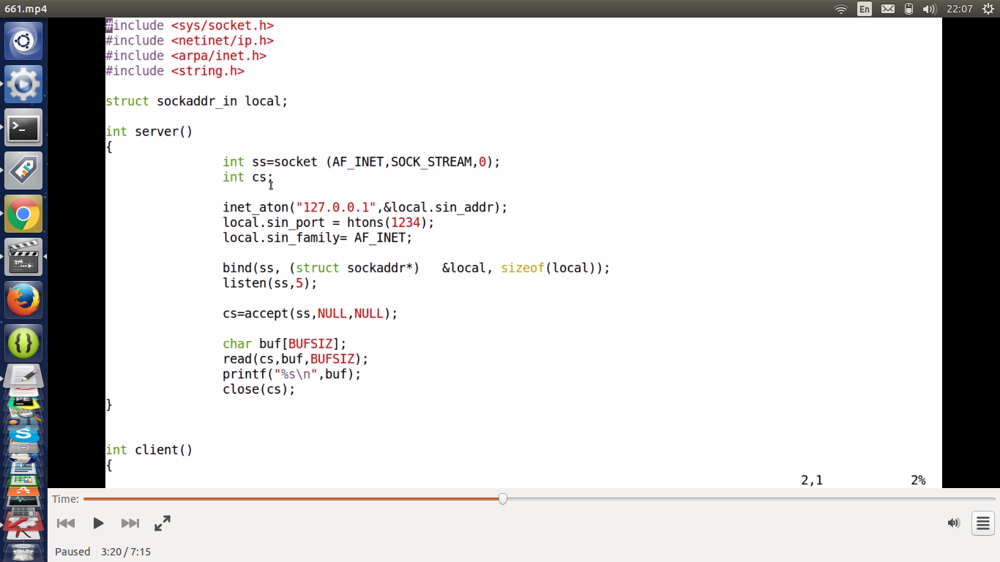

# Сетевые возможности

## Основы функционирования компьютерных сетей

* 7 уровневая модель ИСО далека от реальности
* будем говорить о 4 уровнях (RFC 1122?)
  * канальный (сетевые карты, радиопередатчики и тд) уровень. link. физические адреса (MAC адрес id производителя, устройства, партии...). Кол-во адресов ограничено
    * пакеты маленькие, т.к. передача обычно ненадежна, чтобы поменьше пересылать заново
  * интер-нет (межсетевой). IP адрес. 4 байта. Устройств не более 4 млрд. В них кодируется сеть.
    * сеть - логическая группировка узлов, которые могут взаимодействовать напрямую
    * A класс
      * 1 байт номер сети
      * остальные 3 байта адрес в рамках этой сети
    * B класс
      * 2 байта на сеть, 2 байта на адрес
    * C класс
      * 3/1
    * проблема такой организации - слишком большие скачки при переходе через байт (с 256 компов в сети, до 256 умножить на 256 и пр)
    * поэтому ввели безклассовую адресацию - через битовую маску
    * все адреса внутри сети (определяются по маске сети, сетевой адрес один и тот же) доступны непосредственно
    * компьютер с двумя сетевыми платами имеет 2 физических адреса. Каждой плате можно сопоставить свой ип адрес и маску подсети
    * узел, имеющий 2 сетевых интерфейса в разных сетях и предназначенный для переправки пакетов из одной сети в другую называется маршрутизатором. Адрес маршрутизатора внутри каждой из сетей называется шлюзом
    * у каждого узла есть route table. номер сети | адрес шлюза | метрика как долго будет идти пакет   
    * ARP (address resolution protocol), RARP (reverse ...) -трансляция между физическими и IP адресами
    * Посылают широковещательный запрос типа - есть ли кто то владеющий таким то IP адресом, если есть какой у тебя МАК адрес?
    * Результат запросов кешируются
    * Типы отправки
      * unicast - одному
      * multicast - некоторым
      * broadcast - всем (255.255.255.255). нужен, например, для запроса адреса в новой сети. Протокол DHCP (dynamic host configuration protocol) - DHCP сервер отдает запрашивающему узлу IP адрес, маску подсети, адрес шлюза и пр. По факту может и необычные параметры отдавать типа координат, времени и др   
    
  * транспортный уровень. обеспечивает передачу данных. правила по которым данные передаются
    * протоколы. 
      * UDP (User Datagram Protocol) - доставка не проверяется. Передача видео, интернет-радио - не важно, что часть пакетов потерялась. Мозг достроит
      * TCP (Transfer Control Protocol)
  * прикладной уровень. приложения
    * DNS распределенная БД
    * hosts - локальное соответствие имен и IP адресов
    * если в нем нет IP адреса отправляем запрос на DNS сервер, он уже по иерархии, либо берет из кеша
    * узел тоже умеет кешировать DNS запросы
    
    * за доменным именем стоят службы (сервера), которые умеют обслуживать определенные протоколы - http, почта и пр. Они и расшифровывают адрес. Почта - почтовый адрес, веб сервер - http запрос и пр
    * порт (число) - разные службы на одном IP адресе. Привязано к приложению на сервере
    * есть документ (RFC ...), устанавливающий стандартные значения портов для приложений

* Датацентры
    * виртуальное сетевое оборудование (программа, не устройство). Обладает своим МАК адресом
    * VLAN VXLAN
    * цель - сделать так, чтобы потоки данных на одном компе были логически разделены
    * SDN (Software defined networks). 	Протокол OpenFlow. OpenVSwitch - эмуляция свитча
* Домашний маршрутизатор
  * управляет локальной сетью
  
  * имеет DHCP сервер, умеет обрабатывать broadcast запросы
* Провайдер
  * аналогично. Прописывает шлюз домашнему маршрутизатору
    
## Инструменты Линукс

* ping. Есть ли связь до заданного узла
* tracepath. Путь до узла
* /sbin/ifconfig   (список интерфейсов)
* iwconfig wlan0   (где wlan0 wireless интерфейс)
```
wlan0     IEEE 802.11bgn  ESSID:"Keenetic-3308"  
          Mode:Managed  Frequency:2.437 GHz  Access Point: 10:7B:EF:5F:BF:04   
          Bit Rate=58.5 Mb/s   Tx-Power=15 dBm   
          Retry  long limit:7   RTS thr:off   Fragment thr:off
          Power Management:off
          Link Quality=60/70  Signal level=-50 dBm  
          Rx invalid nwid:0  Rx invalid crypt:0  Rx invalid frag:0
          Tx excessive retries:0  Invalid misc:93   Missed beacon:0
```
* ip
* ip link
* информация о DNS
  * nslookup yandex.ru
  * dig yandex.ru    
* arp -  arp таблицы (физический - IP адреса)
    
## Принципы организации IP сетей




* Протоколы внутри каждого слоя можно менять


* На каждом уровне своя система адресов взаимодействующих сторон. При переходе от уровня к уровню есть средства для трансляции адресов


* Программная часть


* Сокет абстрагирует


### Адресация в IP-сетях


* через С2 идет маршрутизация, из С1 в С3 без С2 не переслать, т.к. в разных сетях


### Понятие сокета


* UDP. Работа с отдельными пакетами
* TCP. Работа с потоком


* TCP. accept создает новый сокет приема для коммуникации с клиентом. Старый используется для установления соединений


### Разрешение имен

* man inet. Преобразование адресов между форматами
* man 7 ip

* Получение IP адреса по доменному имени


### Сокеты дейтаграмм. 	Протокол UDP

* netstat. netstat -anp | grep postgres ищет на каком порту постгресс
* nc может создавать сервер, эмулировать клиента и прочие прелести
  * сервер nc -l 1234
  * клиент nc 127.0.0.1 1234
  * -u общение по протоколу udp (использовать как на сервере, так и на клиенте)
* Сервер UDP
  * запускаем клиента nc 127.0.0.1 -u 1234     -u для udp


	
### Сокеты ориентированные на соединения. Протокол TCP





* send и write близки по интерфейсу

